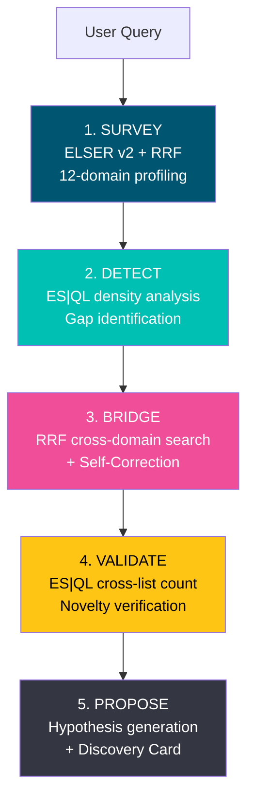
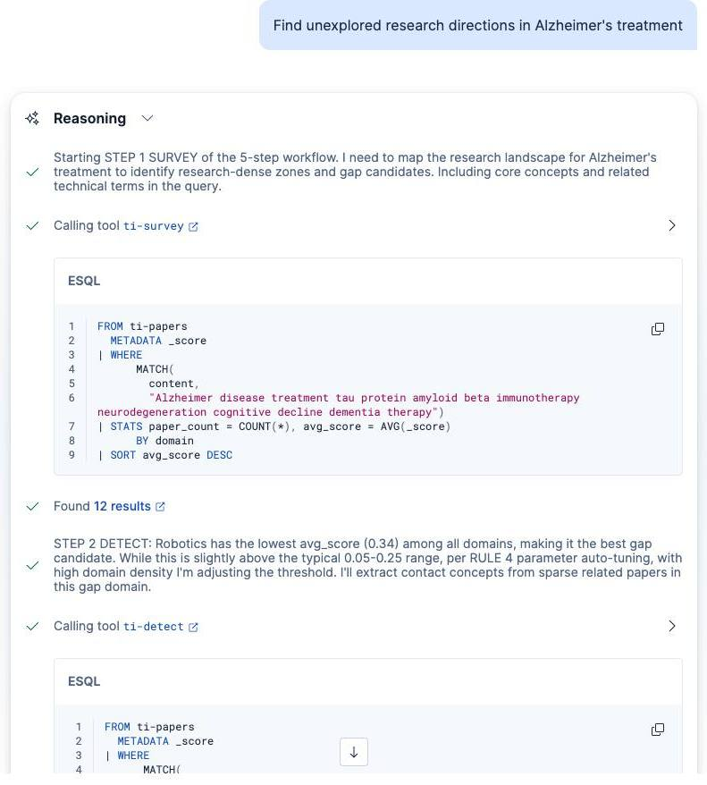
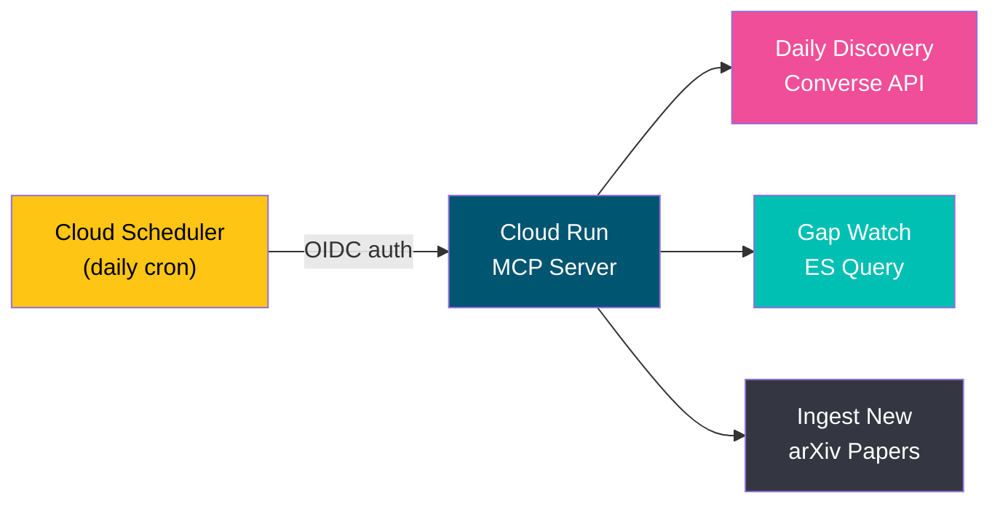
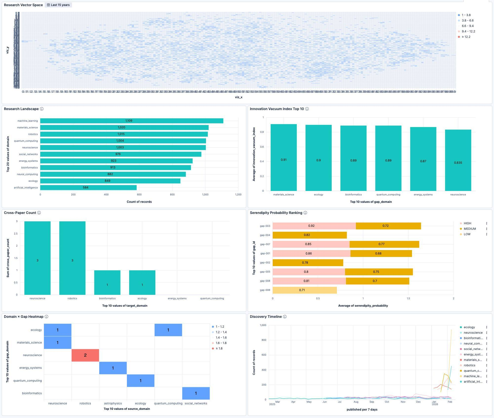

# Terra Incognita: Autonomous Scout for the Unknown

[](https://www.elastic.co/elasticsearch)
[](https://www.elastic.co/kibana)
[](https://www.elastic.co/guide/en/machine-learning/current/ml-nlp-elser.html)
[](https://elasticsearch.devpost.com/)
[](https://opensource.org/licenses/MIT)

> **Existing tools search for papers that exist. Terra Incognita discovers research that doesn't exist yet.**

Every research tool — Semantic Scholar, Connected Papers, Elicit — answers the same question: *"What papers exist?"* But breakthroughs live in the spaces **between** papers. Penicillin = bacteriology + mycology gap. CRISPR = gene editing + bacterial immunology gap. Terra Incognita is an autonomous agent that finds these gaps and bridges them across disciplines.


---

## The Solution: 5-Step Autonomous Discovery

Terra Incognita maps 17,000+ scientific papers across 12 domains, detects "meaningful voids" where research *should* exist but doesn't, and proposes cross-disciplinary bridges — each backed by a dedicated ES|QL tool.



### Discovery Card

Every finding is packaged as a shareable Discovery Card with quantitative scores:

```
+----------------------------------------------+
|  Zwitterionic Polymer x                      |
|  Alzheimer's Amyloid-Beta                    |
|                                              |
|  Innovation Vacuum: top 2%                   |
|  Serendipity: top 5%                         |
|  Cross-papers: 0 -- completely unexplored    |
|                                              |
|  Confidence: HIGH                            |
+----------------------------------------------+
```

### Quantitative Scoring

Two metrics make the abstract concept of "research gap" concrete and comparable:

**Innovation Vacuum Index** — How "meaningfully empty" a gap is:

```
IVI = (relevance x 0.3) + (void x 0.5) + (density/100 x 0.2)
```

| Component | Meaning | Source |
|-----------|---------|--------|
| **Relevance** | Semantic relevance to query | `AVG(_score)` from ELSER |
| **Void** | Absence of cross-domain papers | `1 - (cross / total)` |
| **Density** | Surrounding research activity | `COUNT(*)` in adjacent domains |

A high IVI means the gap is surrounded by active research but the intersection itself is unexplored — the most promising kind of gap.

**Serendipity Probability** — How promising a cross-domain bridge is:

```
SP = (similarity x 0.3) + (novelty x 0.4) + (evidence/50 x 0.3)
```

Both scores are displayed as **percentiles** (e.g., "top 2%") for intuitive interpretation, and all components are exposed individually for **explainability** — the analysis engine is Elasticsearch, not a black-box LLM.

---

## Agent Autonomy

### Self-Correction Protocol

During the BRIDGE step, the agent evaluates and discards false-positive bridge candidates:

1. Discovers N bridge candidates via RRF hybrid search
2. Evaluates each candidate's **mechanistic relevance** (not just keyword overlap)
3. Discards surface-level matches: *"This connection is keyword-only — no mechanistic similarity. Discarded."*
4. Re-searches with alternative concepts (up to 3 retries)
5. Records all discard/accept decisions in the Thought Log

### Parameter Auto-Tuning

The agent adjusts DETECT parameters based on SURVEY results:

- **High domain density** (>500 papers): lowers gap threshold to 0.10–0.20
- **Low domain density** (<50 papers): raises gap threshold to 0.15–0.30
- All adjustments are logged with reasoning in the Thought Log

### Thought Log

Every decision is exposed — ES|QL queries executed, index selection reasoning, self-correction judgments, parameter adjustment rationale. No black box.

---

## Demo

A 3-minute, 4-act demonstration of autonomous research gap discovery:

| Act | Title | What Happens |
|-----|-------|-------------|
| **1** | The Map | Agent surveys 17,000+ papers across 12 domains, produces relevance profile |
| **2** | The Gap | Detects materials science gap (IVI: top 2%), auto-tunes parameters |
| **3** | The Bridge | Self-Correction rejects false positive, discovers zwitterionic polymer bridge |
| **4** | The Watch | Discovery Card + Cloud Scheduler automation (Daily Discovery + Gap Watch) |

**Demo Query**: *"Find unexplored research directions in Alzheimer's treatment"*

**The Wow Moment**: Zwitterionic anti-fouling polymers (materials science) share the same protein-adhesion-prevention mechanism as amyloid-beta aggregation inhibition (neuroscience) — with **zero** existing cross-papers. Two mature fields, completely unexplored intersection, found autonomously.

---

## Elastic Features Used



### Agent Builder — 9-Rule Autonomous Reasoning

A single agent with 7 tools (4 ES|QL + 1 MCP + 2 platform built-in) orchestrated by **pure instruction engineering** — 9 RULE-based instructions with STEP numbering enforce the 5-step workflow, Self-Correction protocol, parameter auto-tuning, and Discovery Card generation. The agent also exposes the **Converse API** for programmatic access.

### ES|QL — Cross-Domain Analytics Pipeline

Four parameterized ES|QL tools power the analytical backbone:

```sql
-- ti-survey: Per-domain relevance profiling
FROM ti-papers | WHERE MATCH(content, ?query) | STATS paper_count = COUNT(*), avg_score = AVG(_score) BY domain

-- ti-validate: Novelty verification via cross-category count
FROM ti-papers | WHERE primary_category IN (?category_a, ?category_b) | STATS paper_count = COUNT(*) BY primary_category
```

Each tool is registered in Agent Builder as a standalone step — full traceability from query to conclusion.

### ELSER v2 — Zero-Pipeline Semantic Embeddings

The `semantic_text` field type handles tokenization, inference, and vector storage automatically. No external embedding service, no indexing pipeline — just a field declaration and 17,000+ papers become semantically searchable.

### RRF Hybrid Search — The Technical Implementation of Serendipity

RRF fuses BM25 keyword scores with vector similarity scores. This is critical for bridge discovery: a paper might not share keywords with the query domain but has high vector similarity — exactly the kind of "unexpected connection" that cross-disciplinary bridges require.

### Index Aliases — Time-Travel Backtesting

Two aliases enable backtesting: `ti-papers_before_2020` (pre-2020 data for discovery) and `ti-papers_all` (full corpus for validation). The framing: *"Using only data available at the time, the agent detected cross-domain signals — and subsequent papers confirmed the connection."*

### Cloud Scheduler + MCP — Automated Discovery Pipeline



Agent Builder's ES|QL tools are read-only. The MCP server (FastMCP on Cloud Run) provides write capability and Cloud Scheduler automation:

| Scheduler Job | Schedule | Action |
|---------------|----------|--------|
| Daily Discovery | 09:00 KST | Full 5-step exploration via Converse API |
| Gap Watch | 10:00 KST | Monitor open gaps for new papers |
| Ingest New | 08:00 KST | Collect latest arXiv papers |

### Kibana Dashboard — Discovery Visualization

6 Lens panels: Research Landscape (t-SNE scatter), Innovation Vacuum Index Top 10, Cross-Paper Count, Serendipity Probability Ranking, Domain x Gap Heatmap, Discovery Timeline.



---

## Differentiation

| Capability | Semantic Scholar | Connected Papers | Elicit | **Terra Incognita** |
|------------|-----------------|-------------------|--------|---------------------|
| Paper search | Yes | Yes | Yes | Yes |
| **Research gap detection** | — | — | — | **Yes** |
| **Cross-domain bridging** | — | — | — | **Yes** |
| **Novelty verification** | — | — | — | **Yes** |
| **Quantitative scoring (IVI/SP)** | — | — | — | **Yes** |
| **Self-correction** | — | — | — | **Yes** |
| **Automated gap monitoring** | — | — | — | **Yes** |
| **Shareable Discovery Card** | — | — | — | **Yes** |

**Core insight**: Existing tools optimize for recall ("find all relevant papers"). Terra Incognita optimizes for **discovery** ("find what nobody has explored yet").

---

## Components

### Agent

**Terra Incognita Scout** — An autonomous research gap detection agent with 9 rules: 5-step workflow, Self-Correction protocol, quantitative scoring, parameter auto-tuning, Discovery Card format, backtest mode, save protocol, personalization, and Gap Watch mode.

### Tools (5 custom + 2 platform)

| Tool | Type | Workflow Step |
|------|------|---------------|
| `ti-survey` | ES\|QL | STEP 1 — Per-domain relevance profiling |
| `ti-detect` | ES\|QL | STEP 2 — Gap detection + density analysis |
| `ti-bridge` | ES\|QL | STEP 3 — Cross-domain bridge discovery via RRF |
| `ti-validate` | ES\|QL | STEP 4 — Novelty verification via cross-category count |
| `ti-save-results` | MCP | Result storage — writes to 4 indices via MCP server |
| `platform.core.execute_esql` | Built-in | Ad-hoc ES\|QL queries (backtest mode) |
| `platform.core.search` | Built-in | Index search for validation |

### MCP Server

FastMCP server on Cloud Run providing write capability and automation:

- `ti_save_results` — Result storage dispatching to 4 indices
- `ti_daily_discovery` — Automated exploration via Converse API
- `ti_gap_watch` — Automated gap monitoring via ES direct query
- `ti_ingest_new` — arXiv paper collection + ES indexing

> **Why MCP instead of Elastic Workflows?** Elastic Workflows (Technical Preview, ES 9.x) have an execution engine bug — registration succeeds but execution fails. All write functionality has been migrated to MCP tools.

### Elasticsearch Indices (5)

| Index | Purpose |
|-------|---------|
| `ti-papers` | Paper corpus (17,000+ papers, 12 domains, `semantic_text` + ELSER) |
| `ti-gaps` | Detected research gaps with Innovation Vacuum Index |
| `ti-bridges` | Cross-domain bridges with Serendipity Probability |
| `ti-exploration-log` | Audit log of agent exploration sessions + Thought Log |
| `ti-discovery-cards` | Auto-generated shareable Discovery Cards |

---

## Setup

### Prerequisites

- Elastic Cloud Hosted (ES 9.x) with ELSER v2 (`.elser-2-elastic`) deployed
- Agent Builder enabled
- `bash`, `curl`, `jq` available

### Quick Start

```bash
# 1. Configure environment
cp .env.example .env
# Edit .env: ES_URL, ES_API_KEY, KIBANA_URL, MCP_SERVER_URL

# 2. Deploy MCP server (Docker → Cloud Run or any HTTPS endpoint)
docker build -t ti-mcp-server mcp-server/
# Deploy and set MCP_SERVER_URL in .env

# 3. Deploy in order
bash setup/01-indices.sh      # 5 ES indices
bash setup/02-aliases.sh      # Backtest aliases
bash setup/03-tools.sh        # 4 ES|QL tools
bash setup/08-mcp-save.sh     # MCP connector + save tool
bash setup/04-agent.sh        # 1 agent
bash setup/05-ingest.sh       # Paper data (~17,000 papers)
bash setup/06-seed-data.sh    # Synthetic seed data
bash setup/07-dashboard.sh    # Dashboard import

# 4. (Optional) Cloud Scheduler for daily automation
bash setup/09-scheduler.sh
```

> Scripts 01-02, 05-06 target `ES_URL`. Scripts 03-04, 07-08 target `KIBANA_URL`. Both use `ES_API_KEY` for auth. All seed data is **synthetic** — no real or confidential data is used.

---

## API Integration

### Converse API

```bash
curl -s -X POST "${KIBANA_URL}/api/agent_builder/converse" \
  -H "Authorization: ApiKey ${ES_API_KEY}" \
  -H "kbn-xsrf: true" -H "Content-Type: application/json" \
  -H "x-elastic-internal-origin: Kibana" \
  -d '{"agent_id": "terra-incognita", "input": "Find unexplored research directions in Alzheimer'\''s treatment"}'
```

### E2E Testing

```bash
bash test/e2e-converse.sh                    # Default query
bash test/e2e-converse.sh "quantum computing gaps"  # Custom query
```

---

## Project Structure

```
terra-incognita/
├── agent/ti-agent.json          # Agent definition (9 rules)
├── tools/                       # 4 ES|QL tool definitions
│   ├── ti-survey.json
│   ├── ti-detect.json
│   ├── ti-bridge.json
│   └── ti-validate.json
├── mcp-server/                  # FastMCP server (Cloud Run)
│   ├── server.py
│   ├── Dockerfile
│   └── requirements.txt
├── indices/                     # 5 index mappings
├── seed-data/                   # Synthetic seed data (NDJSON)
├── ingest/                      # Data pipeline (arXiv collector)
├── setup/                       # Deployment scripts (01-09)
├── test/e2e-converse.sh         # E2E test suite
├── dashboard/                   # Kibana dashboard (NDJSON)
└── .env.example                 # Environment variable template
```

---

## Technology Stack

| Technology | Usage |
|-----------|-------|
| **Elasticsearch 9.x** | Data store, semantic search (ELSER), index aliases for backtest |
| **ELSER v2** | Semantic search via `semantic_text` field type |
| **ES\|QL** | Parameterized queries for gap detection, density analysis, novelty verification |
| **RRF Hybrid Search** | BM25 + Vector fusion for cross-domain bridge discovery |
| **Agent Builder** | 9-rule agent, tool orchestration, Converse API |
| **FastMCP** | MCP server (Python 3.12, Streamable HTTP) |
| **Google Cloud Run** | MCP server hosting (scale-to-zero) |
| **Cloud Scheduler** | Daily Discovery + Gap Watch + Ingest automation |
| **Kibana 9.x** | Dashboard visualization (6 Lens panels) |
| **arXiv API** | Paper data source (12 domains, 17,000+ papers) |

---

## Known Limitations

- **Elastic Workflows** — Technical Preview execution engine bug in ES 9.x. All write and automation functionality migrated to MCP tools.
- **ES|QL Write Operations** — ES|QL is SELECT-only; all writes flow through the MCP server.
- **Kibana `.mcp` Connector Auth** — Does not forward `Authorization` headers to MCP servers. Mitigated with Cloud Run IAM authentication.

---

## Future Work

- **Real-time Gap Alert** — Push notifications when a monitored gap starts filling
- **Multi-corpus support** — Extend beyond arXiv to PubMed, IEEE, bioRxiv
- **Collaborative Discovery** — Share Discovery Cards across research teams
- **Citation graph integration** — Combine gap detection with citation network analysis
- **Confidence calibration** — Track prediction accuracy over time to improve IVI/SP scoring

---

## License

MIT License. See [LICENSE](LICENSE) for details.

---

<p align="center">
  <b>Terra Incognita</b> — Discovering what science hasn't explored yet.<br>
  Built with <a href="https://www.elastic.co/elasticsearch">Elasticsearch</a> Agent Builder
</p>
